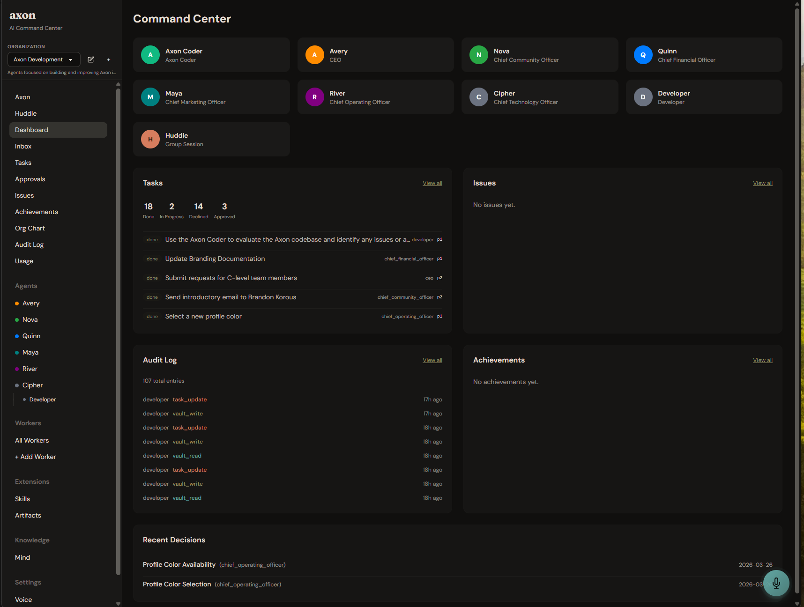
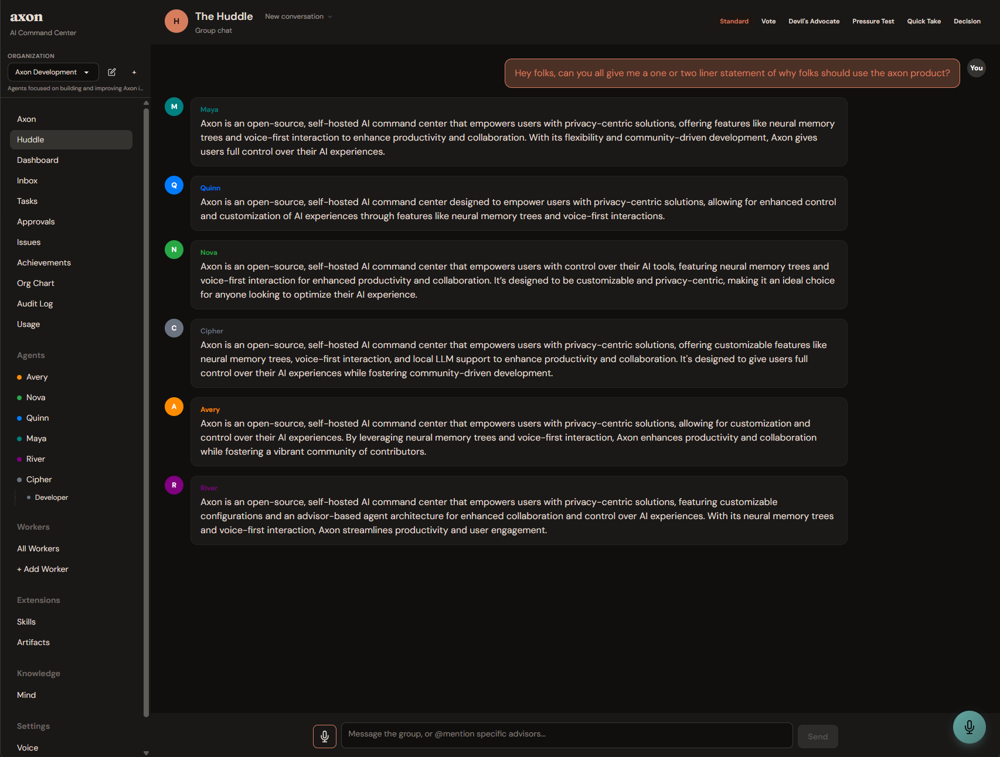

<p align="center">
  
</p>

<p align="center">
  <strong>Your self-hosted AI command center.</strong><br />
  Orchestrate AI advisors with persistent memory, voice interfaces, and a real-time boardroom — entirely on your infrastructure.
</p>

<p align="center">
  <a href="https://github.com/brandonkorous/axon/blob/main/LICENSE"></a>
  <a href="https://github.com/brandonkorous/axon/stargazers"></a>
  <a href="https://hub.docker.com/r/brandonkorous/axon"></a>
  <a href="https://discord.gg/axon"></a>
  <a href="https://github.com/brandonkorous/axon/actions"></a>
  <a href="https://useaxon.dev"></a>
</p>

---

<p align="center">
  
</p>

---

## Why Axon?

Most AI tools give you a chatbot. Axon gives you a **boardroom**.

Run multiple AI advisors — CEO, CTO, COO, and any custom persona you define — that maintain persistent memory across sessions, debate each other in real-time, and proactively surface insights you didn't think to ask for. Everything runs on your machine. Your data never leaves your infrastructure.



---

## Features

### Intelligence

|               | Feature                   | Description                                                                       |
| ------------- | ------------------------- | --------------------------------------------------------------------------------- |
| **Agents**    | Specialist Advisors       | A team of domain experts with distinct personas, vaults, voices, and delegation rules — not one generic chatbot |
| **Boardroom** | Real-Time Huddles         | Group discussions with multiple AI specialists. Six modes: standard, vote, devil's advocate, pressure test, quick take, decision |
| **Brain**     | Structured Reasoning      | Graph-based reasoning engine with multi-strategy evaluation, confidence scoring, contradiction detection, and full decision traceability |
| **Delegate**  | Task Delegation           | Advisors delegate work to each other autonomously (sync or async) across research, audit, implementation, and investigation tasks |
| **Recruit**   | Agent Recruitment         | Request new specialist agents on the fly with user approval workflows |

### Memory

|               | Feature                   | Description                                                                       |
| ------------- | ------------------------- | --------------------------------------------------------------------------------- |
| **Vault**     | Neural Memory Trees       | Obsidian-compatible markdown vaults with YAML frontmatter, wikilinks, full-text search, and graph-based relationship tracking |
| **Consolidate** | Memory Consolidation   | LLM-driven vault maintenance — duplicate merging, stale archiving, contradiction detection, orphan adoption, and confidence scoring |
| **Recall**    | Intelligent Recall        | Context-aware retrieval that surfaces relevant vault entries during conversations. Outcome linking lets advisors learn from experience |
| **Watch**     | Vault Sync                | File watcher for external changes — edit vaults in Obsidian and they sync automatically |

### Interaction

|               | Feature                   | Description                                                                       |
| ------------- | ------------------------- | --------------------------------------------------------------------------------- |
| **Voice**     | Voice-First Interface     | Whisper STT, Piper/ElevenLabs/Azure TTS, per-advisor voice catalog, adjustable speed, continuous voice mode |
| **Connect**   | Platform Integrations     | Slack (Socket Mode), Microsoft Teams (Bot Framework), Zoom (meetings + transcription), Discord (server deployment) |
| **Dashboard** | Command Center            | Unified view: active agents, kanban task board, issues, approvals, vault health, and per-agent cost tracking |
| **Commands**  | Slash Commands            | Direct memory operations: `/sleep`, `/remember`, `/recall`, `/forget`, `/tasks`, `/status` |

### Autonomy

|               | Feature                   | Description                                                                       |
| ------------- | ------------------------- | --------------------------------------------------------------------------------- |
| **Plugins**   | Shell Access & Sandbox    | Grant agents host filesystem access (shell) or containerized execution (sandbox) via configurable plugins with executable allowlists |
| **Sandbox**   | Isolated Sandboxes        | 8 sandbox image types (base, browser, code, data, ML, documents, media, full) with dependency chains and resource limits |
| **Schedule**  | Proactive Scheduling      | Background heartbeat that picks up pending tasks and reviews completed work at configurable intervals |
| **Research**  | Deep Research             | Two-tier LLM strategy (local compression + reasoning analysis), web scraping, YouTube transcript extraction, multi-source synthesis |
| **Media**     | Media Processing          | YouTube transcript extraction and analysis with two-tier compression for cost-effective processing |

### Infrastructure

|               | Feature                   | Description                                                                       |
| ------------- | ------------------------- | --------------------------------------------------------------------------------- |
| **Models**    | Org-Level Model Management | Register models per org, assign roles (navigator, reasoning, memory, agent), with per-agent overrides. Supports Anthropic, OpenAI, DeepSeek, Google, Groq, xAI, or fully local via Ollama |
| **K8s**       | Kubernetes Support        | Run sandboxes as Docker containers (local) or Kubernetes pods (production) — provider abstraction with pre-built images from ghcr.io |
| **Orgs**      | Multi-Organization        | Isolated vaults, agents, and settings per organization with pre-built templates (Startup, Student, Job Hunt, Family, Creator) |
| **Shield**    | Full Audit Trail          | Append-only, immutable audit logs filterable by date, agent, action, or tool — complete transparency |
| **Extend**    | Plugins & Skills          | Plugin architecture with registry and 10 built-in skills (brainstorming, code review, debugging, decision analysis, etc.) |
| **Secure**    | Encryption & Isolation    | AES encryption for stored credentials, container sandboxing for workers, network isolation via Docker or Kubernetes NetworkPolicies |
| **Work**      | Task & Issue Management   | Tasks (P0-P3 priority) with parent-child relationships, activity threads, simplified lifecycle (pending/in progress/blocked/done/accepted), and auto-generated achievements |

---

## System Requirements

| | Cloud LLMs (API) | Local LLMs (Ollama) |
|---|---|---|
| **Docker** | Required | Required |
| **RAM** | 4 GB minimum | 16 GB minimum, 32 GB+ recommended |
| **Disk** | 2 GB | 10–50 GB (depends on models) |
| **GPU** | Not needed | Optional — CUDA GPU with 8 GB+ VRAM strongly recommended |
| **API Key** | Anthropic or OpenAI | Not needed |

### Local LLM Model Sizing Guide

| Your Hardware | Recommended Models | Approx. Download |
|---|---|---|
| 8 GB RAM, no GPU | `llama3:8b`, `phi4-mini:3.8b` | 3–5 GB |
| 16 GB RAM or 6 GB+ VRAM | `qwen2.5:7b`, `mistral:7b` | 4–5 GB |
| 32 GB RAM or 8 GB+ VRAM | `qwen2.5:14b`, `mistral-small:22b` | 9–13 GB |
| 48 GB+ RAM or 12 GB+ VRAM | `qwen2.5:32b`, `llama3.1:70b` | 20–40 GB |

> **Not sure what your system can handle?** Run `axon doctor` after installing — it detects your hardware and recommends models automatically.

---

## Quick Start

### Option A: Axon CLI (recommended)

The CLI detects your system, walks you through LLM provider setup, and recommends models based on your hardware.

**macOS / Linux:**

```bash
# 1. Install the CLI
curl -sS https://get.useaxon.dev | sh

# 2. Create a workspace (interactive — detects hardware, picks models)
axon init my-workspace

# 3. Launch
cd my-workspace && axon start
```

**Windows (PowerShell):**

```powershell
# 1. Install the CLI (requires Docker Desktop + Git for Windows)
irm https://get.useaxon.dev | iex

# 2. Create a workspace (restart your terminal first if prompted)
axon init my-workspace

# 3. Launch
cd my-workspace; axon start
```

> **Windows via WSL?** If you prefer WSL, use the macOS/Linux instructions above inside your WSL terminal.

### Option B: Manual setup

```bash
# 1. Clone the repository
git clone https://github.com/brandonkorous/axon.git && cd axon

# 2. Configure your environment
cp .env.example .env
# Edit .env — add your API keys (Anthropic, OpenAI, or use Ollama for fully local)

# 3. Launch
docker compose up
```

Open **[http://localhost:3000](http://localhost:3000)** and meet your advisors.

> **Want fully local LLMs?** See [Local LLM Support](#local-llm-support) below.

---

## Architecture

Axon runs three services via Docker Compose:

```
┌─────────────────────────────────────────────┐
│                  Frontend                    │
│        React 19 · Vite · TailwindCSS        │
│           DaisyUI · Framer Motion            │
│                 :3000                        │
└──────────────────┬──────────────────────────┘
                   │ REST / WebSocket
┌──────────────────▼──────────────────────────┐
│                  Backend                     │
│      FastAPI · SQLAlchemy · LiteLLM          │
│        SQLite (default) or Postgres          │
│                 :8000                        │
└──────┬───────────────┬──────────────┬───────┘
       │               │              │
┌──────▼──────┐ ┌──────▼──────┐ ┌────▼────────────┐
│ LLM Providers│ │   Ollama    │ │    Sandboxes     │
│Claude, OpenAI│ │ Local LLMs  │ │ Docker or K8s    │
└─────────────┘ │   :11434    │ │ ghcr.io registry │
                └─────────────┘ └─────────────────┘
```

- **Frontend** — React SPA with real-time agent activity, boardroom view, and vault management
- **Backend** — FastAPI server handling agent orchestration, memory persistence, and multi-provider LLM routing via LiteLLM
- **Ollama** (optional) — Run models like `llama3`, `qwen2.5`, and others entirely on your hardware
- **Sandboxes** — Isolated execution environments (Docker containers or Kubernetes pods) with pre-built images for code, browser, data science, ML, and more

---

<details>
<summary><strong>Configuration</strong></summary>

### Environment Variables

Copy `.env.example` to `.env` and configure:

| Variable            | Description                                      | Required            |
| ------------------- | ------------------------------------------------ | ------------------- |
| `ANTHROPIC_API_KEY` | Anthropic API key for Claude models              | If using Claude     |
| `OPENAI_API_KEY`    | OpenAI API key                                   | If using OpenAI     |
| `DEFAULT_MODEL`     | Fallback LLM model (prefer org-level model management) | No             |
| `OLLAMA_BASE_URL`   | Ollama endpoint (default: `http://ollama:11434`) | If using local LLMs |
| `DATABASE_URL`      | Database connection string (default: SQLite)     | No                  |
| `VAULT_PATH`        | Path to the memory vault directory               | No                  |

For a full list of options, see [`.env.example`](.env.example).

</details>

<details>
<summary><strong>Adding Custom Agents</strong></summary>

### Create a New Advisor

Define a new advisor by adding a YAML file to the personas directory:

```yaml
# personas/cfo-advisor.yaml
name: CFO Advisor
role: Chief Financial Officer
description: Financial strategy, fundraising, unit economics, and fiscal discipline.
model: claude-sonnet-4-20250514
voice: onyx
system_prompt: |
    You are a seasoned CFO advising a startup. You focus on burn rate,
    runway, unit economics, and fundraising strategy. Be direct and
    data-driven. Flag financial risks early.
```

Restart the backend and your new advisor appears in the dashboard. No code changes required.

</details>

<details>
<summary><strong>Local LLM Support</strong></summary>

### Run Fully Local with Ollama

No API keys needed. Run everything on your machine:

```bash
docker compose --profile local-llm up
```

This starts Ollama alongside the frontend and backend. Three models are pulled on first start:

| Model | Size | Default Role |
|-------|------|-------------|
| `qwen2.5:7b` | ~4.5 GB | Navigator (tool routing, intent classification) |
| `llama3:8b` | ~4.7 GB | Memory (vault recall, consolidation) |
| `qwen2.5:14b` | ~9 GB | Reasoning (agent conversations) |

Customize via environment variables:

```env
OLLAMA_NAVIGATOR_MODEL=qwen2.5:7b
OLLAMA_MEMORY_MODEL=llama3:8b
OLLAMA_MODEL=qwen2.5:14b
```

To pull additional models or re-run after config changes:

```bash
# Force re-run model pulls
docker compose --profile local-llm up ollama-init --force-recreate

# Pull a specific model manually
docker exec axon-ollama-1 ollama pull qwen2.5:7b

# List available models
docker exec axon-ollama-1 ollama list
```

On first load, Axon prompts you to **register models and assign roles** at the org level. Use "Discover Ollama Models" to auto-detect your local models.

Supported local models include `qwen2.5`, `llama3`, `mistral`, and any model available in the [Ollama library](https://ollama.com/library).

</details>

---

## Roadmap

- [x] Multi-agent orchestration with persistent memory
- [x] Voice-first interface with per-persona voices
- [x] Real-time boardroom / Huddle sessions (6 modes)
- [x] Docker Compose deployment
- [x] Multi-LLM support (Claude, OpenAI, Ollama)
- [x] Achievement system and audit logging
- [x] Slack, Teams, Zoom, and Discord integrations
- [x] Plugin system with registry and built-in web research
- [x] Agent-to-agent delegation chains (sync and async)
- [x] Scheduled agent behaviors (task pickup, done review)
- [x] Structured reasoning engine with decision graphs
- [x] Memory consolidation and intelligent recall
- [x] Shell access and sandbox plugins for agent execution
- [x] Deep research with web scraping and YouTube transcripts
- [x] Skills system (brainstorming, code review, debugging, decision analysis, etc.)
- [x] Organization templates (Startup, Student, Job Hunt, Family, Creator)
- [x] Simplified task lifecycle with parent-child tasks and auto-achievements
- [x] Google Calendar and Linear integrations
- [x] Org-level model management with role assignments and curated catalog
- [x] Kubernetes sandbox support with provider abstraction (Docker + K8s)
- [x] Pre-built sandbox images via GitHub Container Registry
- [ ] Tool router — navigator model selects and instructs agent tools
- [ ] RAG over uploaded documents and codebases
- [ ] Mobile companion app
- [ ] Multi-user collaboration with role-based access
- [ ] One-click cloud deploy templates (Railway, Fly.io)
- [ ] Webhook triggers for external event-driven advice

---

## Contributing

We welcome contributions of all kinds. See [**CONTRIBUTING.md**](CONTRIBUTING.md) for guidelines on getting started, code style, and the PR process.

Before opening a large PR, please open an issue or discussion first so we can align on approach.

---

## Community

- **Website** — [useaxon.dev](https://useaxon.dev) for docs, blog, and getting started guides
- **Discord** — [Join the server](https://discord.gg/axon) for support, feature discussions, and showcases
- **GitHub Discussions** — [Ask questions and share ideas](https://github.com/brandonkorous/axon/discussions)
- **Twitter / X** — Follow [@axon_ai](https://twitter.com/axon_ai) for updates

---

## License

Axon is licensed under the [**GNU Affero General Public License v3.0 (AGPL-3.0)**](LICENSE).

You are free to use, modify, and self-host Axon. If you distribute a modified version or run it as a network service, you must make your source code available under the same license.

---

<p align="center">
  Built with ❤️ by the Axon community
</p>
