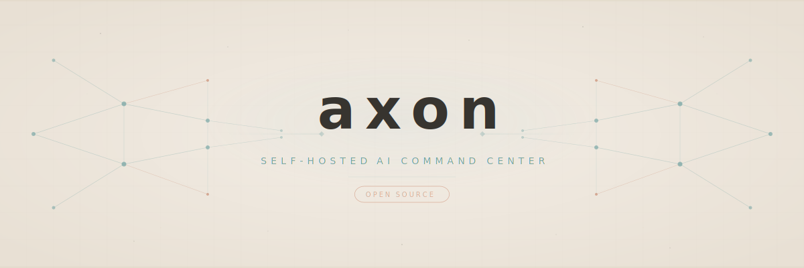

<p align="center">
  
</p>

<p align="center">
  <strong>Your self-hosted AI command center.</strong><br />
  Orchestrate AI advisors with persistent memory, voice interfaces, and a real-time boardroom — entirely on your infrastructure.
</p>

<p align="center">
  <a href="https://github.com/brandonkorous/axon/blob/main/LICENSE"></a>
  <a href="https://github.com/brandonkorous/axon/stargazers"></a>
  <a href="https://hub.docker.com/r/brandonkorous/axon"></a>
  <a href="https://discord.gg/axon"></a>
  <a href="https://github.com/brandonkorous/axon/actions"></a>
</p>

---

<p align="center">
  
</p>

---

## Why Axon?

Most AI tools give you a chatbot. Axon gives you a **boardroom**.

Run multiple AI advisors — CEO, CTO, COO, and any custom persona you define — that maintain persistent memory across sessions, debate each other in real-time, and proactively surface insights you didn't think to ask for. Everything runs on your machine. Your data never leaves your infrastructure.

---

## Features

| | Feature | Description |
|---|---|---|
| **Agents** | Multi-Agent Orchestration | Run multiple AI advisors simultaneously with distinct personas and expertise |
| **Memory** | Persistent Neural Memory | Structured vault-based memory that survives across sessions (Obsidian-compatible) |
| **Voice** | Voice-First Interface | Talk to your advisors — each persona has a distinct voice |
| **Boardroom** | Real-Time Huddles | Watch advisors discuss, debate, and converge on recommendations live |
| **Brain** | Proactive Intelligence | Agents surface insights and flag issues without being asked |
| **Runner** | Autonomous Task Execution | Agents can execute code and complete tasks on their own |
| **Models** | Multi-LLM Support | Anthropic Claude, OpenAI, or local models via Ollama |
| **Orgs** | Multi-Organization | Isolated vaults and agent configurations per organization |
| **Shield** | Full Audit Logging | Complete transparency into every agent action and decision |
| **Dashboard** | Command & Control | Active agents, decisions, action items, inbox, vault health — one view |

---

## Quick Start

Get Axon running in under two minutes.

```bash
# 1. Clone the repository
git clone https://github.com/brandonkorous/axon.git && cd axon

# 2. Configure your environment
cp .env.example .env
# Edit .env — add your API keys (Anthropic, OpenAI, or use Ollama for fully local)

# 3. Launch
docker compose up
```

Open **[http://localhost:3000](http://localhost:3000)** and meet your advisors.

> **Want fully local LLMs?** See [Local LLM Support](#local-llm-support) below.

---

## Architecture

Axon runs three services via Docker Compose:

```
┌─────────────────────────────────────────────┐
│                  Frontend                    │
│        React 19 · Vite · TailwindCSS        │
│           DaisyUI · Framer Motion            │
│                 :3000                        │
└──────────────────┬──────────────────────────┘
                   │ REST / WebSocket
┌──────────────────▼──────────────────────────┐
│                  Backend                     │
│      FastAPI · SQLAlchemy · LiteLLM          │
│        SQLite (default) or Postgres          │
│                 :8000                        │
└──────────┬───────────────────┬──────────────┘
           │                   │
   ┌───────▼───────┐   ┌──────▼──────┐
   │  LLM Providers │   │   Ollama    │
   │ Claude, OpenAI │   │ Local LLMs  │
   └───────────────┘   │   :11434    │
                        └─────────────┘
```

- **Frontend** — React SPA with real-time agent activity, boardroom view, and vault management
- **Backend** — FastAPI server handling agent orchestration, memory persistence, and multi-provider LLM routing via LiteLLM
- **Ollama** (optional) — Run models like `llama3`, `qwen2.5`, and others entirely on your hardware

---

<details>
<summary><strong>Configuration</strong></summary>

### Environment Variables

Copy `.env.example` to `.env` and configure:

| Variable | Description | Required |
|---|---|---|
| `ANTHROPIC_API_KEY` | Anthropic API key for Claude models | If using Claude |
| `OPENAI_API_KEY` | OpenAI API key | If using OpenAI |
| `DEFAULT_MODEL` | Default LLM model identifier | Yes |
| `OLLAMA_BASE_URL` | Ollama endpoint (default: `http://ollama:11434`) | If using local LLMs |
| `DATABASE_URL` | Database connection string (default: SQLite) | No |
| `VAULT_PATH` | Path to the memory vault directory | No |

For a full list of options, see [`.env.example`](.env.example).

</details>

<details>
<summary><strong>Adding Custom Agents</strong></summary>

### Create a New Advisor

Define a new advisor by adding a YAML file to the personas directory:

```yaml
# personas/cfo-advisor.yaml
name: CFO Advisor
role: Chief Financial Officer
description: Financial strategy, fundraising, unit economics, and fiscal discipline.
model: claude-sonnet-4-20250514
voice: onyx
system_prompt: |
  You are a seasoned CFO advising a startup. You focus on burn rate,
  runway, unit economics, and fundraising strategy. Be direct and
  data-driven. Flag financial risks early.
```

Restart the backend and your new advisor appears in the dashboard. No code changes required.

</details>

<details>
<summary><strong>Local LLM Support</strong></summary>

### Run Fully Local with Ollama

No API keys needed. Run everything on your machine:

```bash
docker compose --profile local-llm up
```

This starts Ollama alongside the frontend and backend. Models are pulled automatically on first use.

Set your default model in `.env`:

```env
DEFAULT_MODEL=ollama/llama3
OLLAMA_BASE_URL=http://ollama:11434
```

Supported local models include `llama3`, `qwen2.5`, `mistral`, `codellama`, and any model available in the [Ollama library](https://ollama.com/library).

</details>

---

## Roadmap

- [x] Multi-agent orchestration with persistent memory
- [x] Voice-first interface with per-persona voices
- [x] Real-time boardroom / Huddle sessions
- [x] Docker Compose deployment
- [x] Multi-LLM support (Claude, OpenAI, Ollama)
- [x] Achievement system and audit logging
- [ ] Plugin system for third-party integrations
- [ ] Mobile companion app
- [ ] Agent-to-agent delegation chains
- [ ] RAG over uploaded documents and codebases
- [ ] Scheduled agent briefings (daily standup, weekly report)
- [ ] Webhook triggers for external event-driven advice
- [ ] Multi-user collaboration with role-based access
- [ ] One-click cloud deploy templates (Railway, Fly.io)

---

## Contributing

We welcome contributions of all kinds. See [**CONTRIBUTING.md**](CONTRIBUTING.md) for guidelines on getting started, code style, and the PR process.

Before opening a large PR, please open an issue or discussion first so we can align on approach.

---

## Community

- **Discord** — [Join the server](https://discord.gg/axon) for support, feature discussions, and showcases
- **GitHub Discussions** — [Ask questions and share ideas](https://github.com/brandonkorous/axon/discussions)
- **Twitter / X** — Follow [@axon_ai](https://twitter.com/axon_ai) for updates

---

## License

Axon is licensed under the [**GNU Affero General Public License v3.0 (AGPL-3.0)**](LICENSE).

You are free to use, modify, and self-host Axon. If you distribute a modified version or run it as a network service, you must make your source code available under the same license.

---

<p align="center">
  Built with ❤️ by the Axon community
</p>
